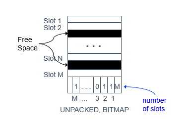

# 如何分页使用二进制流读取文件并分页储存

> 灵感启发自陈晓煜

- 二进制读写：很简单就是 fopen fread fwrite fclose 那些东西，使用它们来读写文件即可满足要求，别撞到 << >> 之类的位操作的南墙上面。

- 页的结构是横向分割的结构，换言之就是矩阵的每k行分割一次。假设矩阵有 n 列 k*m 行，那就把 n 列 k 行 分割成一个 page，也就是单独的一个个文件，命名为 001 - 00m.dat 之类的，储存在磁盘上。

- 50 * 64 k 的缓冲区的含义是，申请一个 50 * 64 k 的内存空间用作文件读取，第一次 mlloc。之后每一次写入新的之前都 memset 一下即可。

- 000.dat 据说要存储信息是如何分割的，之类的元信息，但是我觉得大家都已经约定好了，所以说也没什么必要再来这么一份。

- 按顺序读入之前存好的页文件，就可以恢复原来的文件结构。但是，由于缓冲区大小的限制，读操作和数据处理操作都要在这么小的缓冲区上进行，这是需要解决的难点。